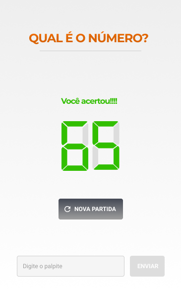
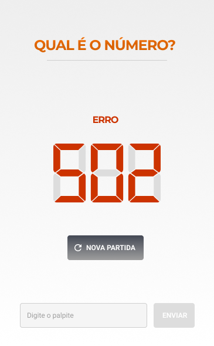
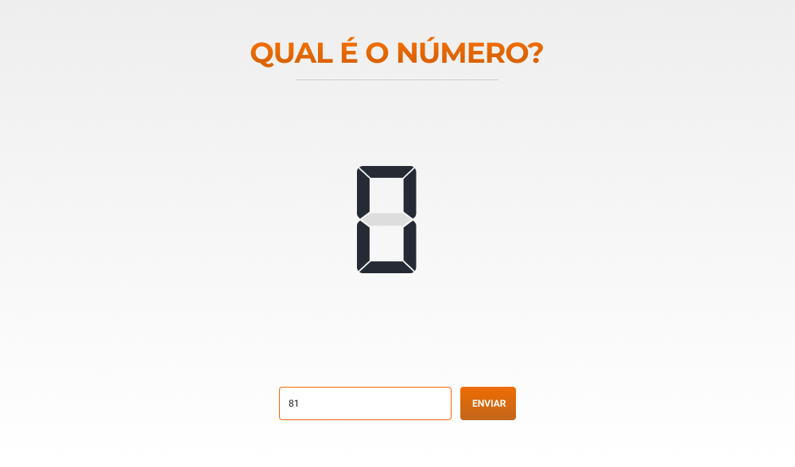

# Overview

Project developed following Studio Sol's proposal. \
The application consists of a guessing game where a request is made to an external API, which returns a number between 1 and 300 that the user must guess. \
Application should be developed using HTML, CSS and Javascript, which led me to choose using the React library.

# Initial Design

## Mobile

.
.

## Desktop

.

# Issues and what I've learned

The biggest challenge was figuring out how to make the number display into an 7-segment LED styled digit, which I did after implementing the main application logic (until that point I was using a simple paragraph to display the numbers). \
The solution I got to was creating a component that consists of two divs stacked together and styling the corresponding borders according to the numbers given by the player inputs.

Upon debugging the application, I realized that some components kept re-rendering every time the input was changed, which could cause perfomance issues. \
After some research I've discovered that this is due to the context API, which doesn't discriminate which states are being updated, but rather automatically updates everything being consumed inside the provider.
Up to this point, I had created only a global context that held all the states, including the player guesses, so my solution was creating a separate context specific for them, which was then provided to the input and button components.

# Improvement for future versions

Project is lacking tests, which I have yet to learn how to implement.

# Live Demo

[https://guess-the-number-yukio.netlify.app](https://guess-the-number-yukio.netlify.app)